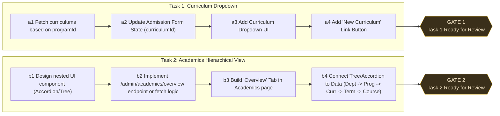

# Plan: Academics Curriculum Updates

This plan covers adding the Curriculum selection to the admissions form and redesigning the Academics page to provide a hierarchical overview.

## Node Details

### Task 1: Curriculum Dropdown in Admission Form (apps/web/src/app/admin/admissions/students/new/page.tsx)

- **a1**: Use the existing API client to fetch curriculums (`/admin/curriculums?programId=${programId}`) when `programId` changes, storing in `curriculums` state.
- **a2**: Add `curriculumId: ''` to `formData` and `const [curriculums, setCurriculums] = useState([])`.
- **a3**: Render the `<select>` next to the Program select.
- **a4**: Add a `<Button>` (plus icon) next to the select. If clicked, it redirects to `/admin/academics/programs/${formData.programId}/curriculums/new` instead of opening a modal. Disable it if `programId` is not selected.

### Task 2: Academics Hierarchical Overview (apps/web/src/app/admin/academics/page.tsx)

- **b1**: Introduce an `Accordion` or expandable list in a new "Overview" tab that structures the academic entities.
- **b2**: Create the data-fetching logic. We may need to stitch together `departments`, `programs`, `curriculums`, `terms`, and `courses`.
- **b3**: Add the "Overview" tab as the default active tab.
- **b4**: Render the hierarchy:
  - **Department** (e.g., Computer Science)
    - **Program** (e.g., B.Tech CS)
      - **Curriculum** (e.g., 2024-2028 Batch Curriculum)
        - **Terms** (e.g., Semester 1)
          - **Courses** (e.g., Data Structures)

## Open Questions

- **b2 Fetching**: Does the backend already provide a nested `GET /admin/departments/hierarchy` endpoint, or will the UI need to fetch these relationships step-by-step lazily on expand? Lazy fetching is preferred to avoid overwhelming the network.

## Next Steps

Please review the plan above. If the shape is approved, parallel workers can begin executing **T1** and **T2**.
